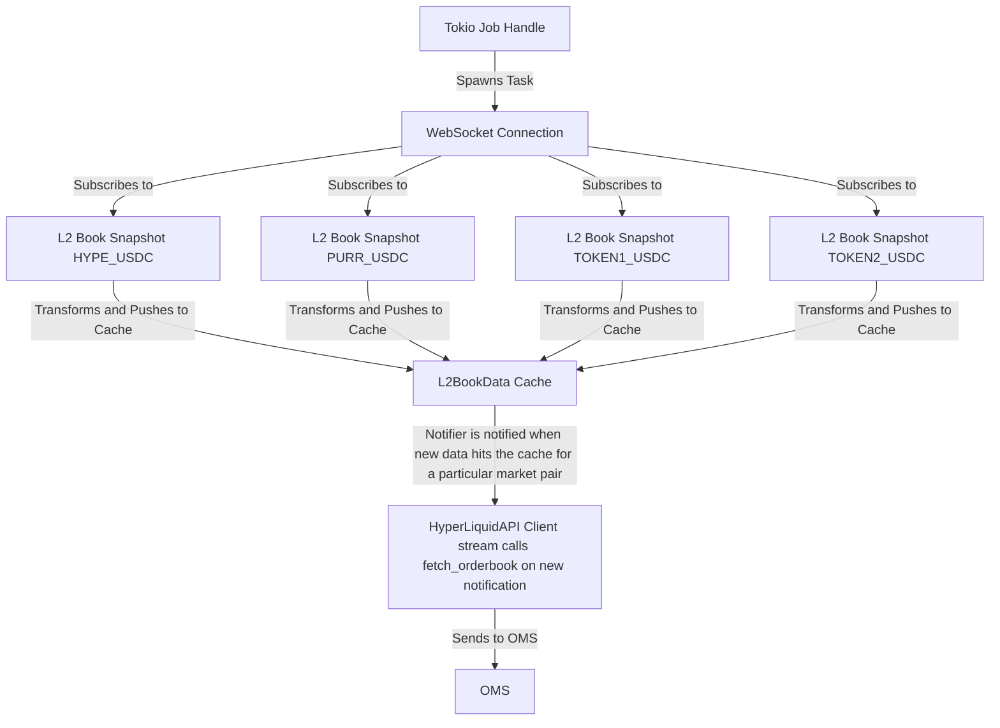
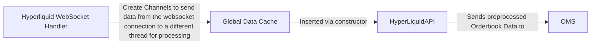
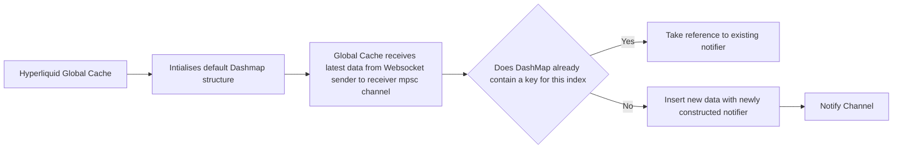

# Service Architecture

## Components

### Websocket Handler

#### Communication using Channels

The WebSocket handler, API client and Global Data Cache all communicate through channels in the following ways:

1. Websocket -> Global Data Cache
2. 

### Latest Data Cache - HyperLiquidGlobalMarketDataHandler

### HyperLiquidApiClient

## Service Diagram

## Component Architecture

## Ordering Sequence Diagram

With Exchange Client we have the following process Create Exchange Client -> ClientOrderRequest -> Order -> Receive

## Notification Sequence Diagram

Each DashMap Entry has its own Notifier, thus implying a notification per orderbook for the market pair. Below is an example of how the Notifiers get instantiated.

Please see doc comments in connector commons() for what a notifier is.

