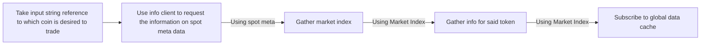

# Notes on HyperLiquid

## What is HyperLiquid

Hyperliquid is a decentralised exchange living on its own L1. It h

## Hyperliquid Clients

There are two clients from the rust sdk, the info client and exchange, to former is responsible for gathering information whereas the latter is responsible for performing actions on the exchange, both spot and perp.

### InfoClient

The info client is used to grab information from the hyperliquid network specified
It consists of two parts a http client and a websocket client that is initially null, but created when you use its functionality.
It comes with a host of functions that are wrappers around the HTTPS API and also websocket management.

#### HyperLiquid Orderbook data

Order book data comes in the form of L2 data, which has a data key which then holds L2BookData, this is a snapshot of the orderbook for a particualr market pair.

The data looks like the following:

```rust
coin:
time:
levels:
```

Where Levels can be described as a vector of vectors containing BookLevel data with the following structure:

```rust
BookLevel { 
    px: "2752.8", 
    sz: "13.9962", 
    n: 2 
}
```

where:

px = a string representing price
sz = a string representing size
n = a number representing "The number of different orders that comprise the level" referinf  to the total count of distinct orders that exist at a given price level in an order book.

#### The universe and its Tokens

BASE/QUOTE pairs are not represented by string such as HYPE/USDC but by index `@1057`

#### Usage Diagram



_Note_: The current architecture only supports trading of one token, it is planned to take an input and allow dynamic token selection for spot trades.

## Exchange Client
